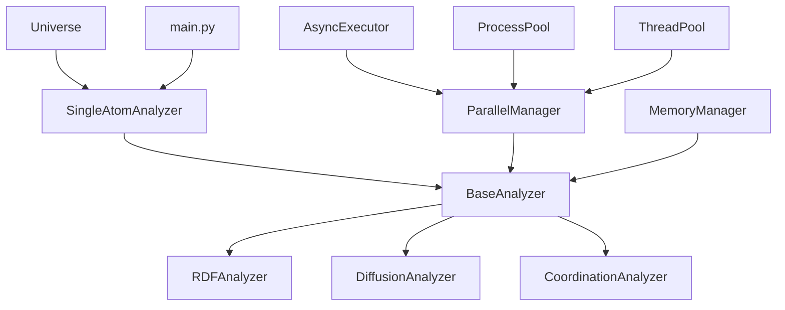

# MDemon单原子分析架构设计计划书

## 1. 项目概述

### 1.1 项目背景
MDemon是一个分子动力学分析框架，基于Universe/Database/Structure的核心架构。本计划旨在构建一个高效的单原子分析子系统，用于分析以单个原子为基本单元的物理化学性质，如径向分布函数(RDF)、原子扩散、配位数等。

### 1.2 设计目标
- **模块化设计**：遵循MDemon现有的模块化架构
- **高性能并行**：利用OpenMP/异步处理实现大规模并行计算
- **易用性**：提供简洁的API接口，支持`from MDemon.analysis.single_atom import ...`
- **可扩展性**：支持新的单原子分析方法的快速集成

### 1.3 架构特点
- **以原子为中心**：每个分析方法都围绕单个原子展开
- **异步并行处理**：利用Python的asyncio和multiprocessing实现高效并行
- **内存优化**：采用流式处理和数据分块技术
- **时间序列支持**：全面支持时间依赖分析

## 2. 系统架构设计

### 2.1 整体架构

```
MDemon/
├── analysis/
│   └── single_atom/
│       ├── __init__.py              # 模块导出接口
│       ├── base.py                  # 基础类和通用函数
│       ├── rdf.py                   # 径向分布函数分析
│       ├── diffusion.py             # 扩散分析
│       ├── coordination.py          # 配位数分析
│       └── main.py                  # 统一对外接口
├── utils/
│   ├── __init__.py
│   ├── irradiation.py              # 现有辐照计算插件
│   └── parallel.py                 # 基于Dask的并行处理工具
└── tests/
    ├── __init__.py
    ├── test_base.py                 # 现有基础测试
    ├── test_constants.py            # 现有常量测试
    ├── test_flags.py                # 现有标志测试
    ├── test_single_atom_base.py     # 单原子基础测试
    ├── test_single_atom_rdf.py      # 单原子RDF测试
    ├── test_single_atom_diffusion.py # 单原子扩散测试
    ├── test_single_atom_coordination.py # 单原子配位测试
    └── test_single_atom_main.py     # 单原子主接口测试
```

### 2.2 核心组件关系



## 3. 详细设计规范

### 3.1 base.py - 基础架构

#### 3.1.1 核心基类设计
**位置**: `MDemon/analysis/single_atom/base.py`

```python
from abc import ABC, abstractmethod
from ..utils.parallel import DaskParallelManager

class SingleAtomAnalyzer(ABC):
    """单原子分析器基类，基于Dask的简化设计"""
    
    def __init__(self, universe, atom_selection=None, scheduler='threads', **kwargs):
        """
        Parameters:
        -----------
        universe : MDemon.Universe
            分析的宇宙对象
        atom_selection : numpy.ndarray, optional
            原子选择掩码，长度为len(universe.atoms)的布尔数组
            默认为None（等价于全选所有原子）
        scheduler : str
            Dask调度器：'threads', 'processes', 'distributed'
        """
        self.universe = universe
        self.atom_selection = atom_selection
        # 直接使用DaskParallelManager，自动内存管理
        self.parallel_manager = DaskParallelManager(scheduler=scheduler, **kwargs)
        
    @abstractmethod
    def analyze_single_atom(self, atom_index, **kwargs):
        """分析单个原子的抽象方法"""
        pass
        
    def analyze_parallel(self, atom_indices=None, **kwargs):
        """并行分析多个原子，Dask自动处理内存管理"""
        if atom_indices is None:
            atom_indices = self._get_selected_atoms()
        
        # Dask自动优化内存使用和任务调度
        return self.parallel_manager.parallel_apply(
            self.analyze_single_atom, atom_indices
        )
        
    def analyze_large_system(self, **kwargs):
        """分析大规模系统，Dask自动分块和内存管理"""
        atom_indices = self._get_selected_atoms()
        
        # 对于大规模系统，使用batch_compute自动优化
        from dask import delayed
        tasks = [
            delayed(self.analyze_single_atom)(idx) 
            for idx in atom_indices
        ]
        
        return self.parallel_manager.batch_compute(tasks, batch_size='auto')
        
    def _get_selected_atoms(self):
        """获取选中的原子索引"""
        if self.atom_selection is None:
            # 默认全选，返回所有原子索引
            return list(range(self.universe.n_atoms))
        else:
            # atom_selection是一个掩码，长度为len(self.universe.atoms)
            import numpy as np
            if len(self.atom_selection) != self.universe.n_atoms:
                raise ValueError(f"atom_selection mask length ({len(self.atom_selection)}) "
                               f"must match number of atoms ({self.universe.n_atoms})")
            return np.where(self.atom_selection)[0].tolist()
            
    def __del__(self):
        """清理资源"""
        if hasattr(self, 'parallel_manager'):
            self.parallel_manager.close()
```

#### 3.1.2 基于Dask的并行处理
**位置**: `MDemon/utils/parallel.py`

```python
import dask
import dask.array as da
from dask import delayed, compute
from dask.distributed import Client, as_completed
import numpy as np

class DaskParallelManager:
    """基于Dask的并行处理管理器，自动内存管理"""
    
    def __init__(self, scheduler='threads', memory_limit='auto'):
        """
        Parameters:
        -----------
        scheduler : str
            Dask调度器：'threads', 'processes', 'distributed'
        memory_limit : str or int
            内存限制，'auto'表示自动检测，或指定GB数
        """
        self.scheduler = scheduler
        self.memory_limit = memory_limit
        self._client = None
        
        if scheduler == 'distributed':
            self._client = Client(memory_limit=memory_limit)
            
    def parallel_apply(self, func, data_list, chunk_size='auto'):
        """并行应用函数到数据列表，自动内存管理"""
        # 创建delayed任务
        tasks = [delayed(func)(item) for item in data_list]
        
        # Dask自动处理内存管理和任务调度
        return compute(*tasks, scheduler=self.scheduler)
        
    def parallel_map_blocks(self, func, data_array, **kwargs):
        """对大数组并行应用函数，支持大于内存的数据"""
        if not isinstance(data_array, da.Array):
            # 转换为dask数组，自动分块
            data_array = da.from_array(data_array, chunks='auto')
            
        return data_array.map_blocks(func, **kwargs)
        
    def create_dask_array(self, shape, dtype=np.float64, chunks='auto'):
        """创建dask数组，自动内存优化"""
        return da.zeros(shape, dtype=dtype, chunks=chunks)
        
    def batch_compute(self, tasks, batch_size='auto'):
        """批量计算任务，防止内存溢出"""
        if batch_size == 'auto':
            # Dask自动确定最优批大小
            return compute(*tasks, scheduler=self.scheduler)
        else:
            # 手动批处理
            results = []
            for i in range(0, len(tasks), batch_size):
                batch = tasks[i:i+batch_size]
                batch_results = compute(*batch, scheduler=self.scheduler)
                results.extend(batch_results)
            return results
            
    def close(self):
        """关闭分布式客户端"""
        if self._client:
            self._client.close()
```

#### 3.1.3 简化的架构设计
**核心理念**: 直接使用`MDemon/utils/parallel.py`中的`DaskParallelManager`，无需额外的适配器层

**架构优势**:
- **简化设计**: 移除不必要的中间适配器层
- **自动内存管理**: Dask自动处理内存优化、分块和任务调度
- **清晰分层**: Dask逻辑完全封装在utils层，上层分析模块只需调用简单接口


### 3.2 rdf.py - 径向分布函数分析

#### 3.2.1 RDF核心算法
```python
class RDFAnalyzer(SingleAtomAnalyzer):
    """径向分布函数分析器"""
    
    def __init__(self, universe, atom_selection=None, 
                 r_range=(0.0, 10.0), n_bins=100, **kwargs):
        """
        Parameters:
        -----------
        r_range : tuple
            径向距离范围 (r_min, r_max)
        n_bins : int
            距离分箱数量
        """
        super().__init__(universe, atom_selection, **kwargs)
        self.r_range = r_range
        self.n_bins = n_bins
        self.r_bins = np.linspace(r_range[0], r_range[1], n_bins)
        
    def analyze_single_atom(self, atom_index, reference_atoms=None, **kwargs):
        """计算单个原子的RDF"""
        
    async def analyze_parallel_rdf(self, atom_indices=None, **kwargs):
        """并行计算多个原子的RDF"""
        
    def compute_rdf_optimized(self, center_atom, reference_atoms, box):
        """优化的RDF计算，利用MDemon的距离计算库"""
```

#### 3.2.2 时间依赖RDF
```python
class TimeResolvedRDFAnalyzer(RDFAnalyzer):
    """时间分辨RDF分析器"""
    
    def analyze_trajectory(self, atom_indices, frame_range=None, **kwargs):
        """分析轨迹中的时间依赖RDF"""
        
    def compute_time_correlation(self, rdf_series):
        """计算时间相关函数"""
```

### 3.3 diffusion.py - 扩散分析

#### 3.3.1 扩散系数计算
```python
class DiffusionAnalyzer(SingleAtomAnalyzer):
    """扩散分析器"""
    
    def __init__(self, universe, atom_selection=None, 
                 time_window=None, **kwargs):
        """
        Parameters:
        -----------
        time_window : tuple, optional
            时间窗口 (start_time, end_time)
        """
        
    def analyze_single_atom(self, atom_index, **kwargs):
        """计算单个原子的扩散系数"""
        
    def compute_msd(self, atom_index, time_series):
        """计算均方位移(MSD)"""
        
    def compute_diffusion_coefficient(self, msd_data, time_data):
        """从MSD计算扩散系数"""
```

### 3.4 coordination.py - 配位数分析

#### 3.4.1 配位数计算
```python
class CoordinationAnalyzer(SingleAtomAnalyzer):
    """配位数分析器"""
    
    def __init__(self, universe, atom_selection=None, 
                 cutoff_distance=3.0, **kwargs):
        """
        Parameters:
        -----------
        cutoff_distance : float
            配位数计算的截止距离
        """
        
    def analyze_single_atom(self, atom_index, **kwargs):
        """计算单个原子的配位数"""
        
    def compute_coordination_number(self, center_atom, neighbors, cutoff):
        """计算配位数"""
        
    def analyze_coordination_shell(self, atom_index, shell_number=1):
        """分析第n配位壳层"""
```

### 3.5 main.py - 统一接口

#### 3.5.1 主接口设计
```python
class SingleAtomAnalysis:
    """单原子分析主接口"""
    
    def __init__(self, universe, **kwargs):
        """
        Parameters:
        -----------
        universe : MDemon.Universe
            分析的宇宙对象
        """
        self.universe = universe
        self._analyzers = {}
        self._initialize_analyzers()
        
    def rdf(self, atom_selection=None, **kwargs):
        """RDF分析接口"""
        return self._analyzers['rdf'].analyze_parallel(
            atom_selection=atom_selection, **kwargs
        )
        
    def diffusion(self, atom_selection=None, **kwargs):
        """扩散分析接口"""
        return self._analyzers['diffusion'].analyze_parallel(
            atom_selection=atom_selection, **kwargs
        )
        
    def coordination(self, atom_selection=None, **kwargs):
        """配位数分析接口"""
        return self._analyzers['coordination'].analyze_parallel(
            atom_selection=atom_selection, **kwargs
        )
        
    async def analyze_all(self, atom_selection=None, **kwargs):
        """同时进行所有分析"""
        results = await asyncio.gather(
            self.rdf(atom_selection, **kwargs),
            self.diffusion(atom_selection, **kwargs),
            self.coordination(atom_selection, **kwargs)
        )
        return {
            'rdf': results[0],
            'diffusion': results[1],
            'coordination': results[2]
        }
```

## 4. 性能优化策略

### 4.1 并行化策略

#### 4.1.1 三级并行架构
1. **原子级并行**：不同原子的分析并行执行
2. **帧级并行**：时间序列数据的并行处理
3. **计算级并行**：单个计算任务的内部并行（利用OpenMP）

#### 4.1.2 自适应负载均衡
```python
class LoadBalancer:
    """负载均衡器"""
    
    def __init__(self, n_workers):
        self.n_workers = n_workers
        self.task_queue = asyncio.Queue()
        self.result_queue = asyncio.Queue()
        
    async def distribute_tasks(self, tasks):
        """智能分发任务"""
        
    def estimate_task_complexity(self, task):
        """估算任务复杂度"""
```

### 4.2 内存优化

#### 4.2.1 流式处理
```python
class StreamProcessor:
    """流式数据处理器"""
    
    def __init__(self, chunk_size=1000):
        self.chunk_size = chunk_size
        
    async def process_stream(self, data_generator, process_func):
        """流式处理数据"""
        
    def optimize_chunk_size(self, total_size, available_memory):
        """优化分块大小"""
```

#### 4.2.2 数据缓存策略
```python
class DataCache:
    """数据缓存管理"""
    
    def __init__(self, max_size_gb=2.0):
        self.max_size = max_size_gb * 1024**3
        self.cache = {}
        
    def get_cached_distances(self, atom_pair):
        """获取缓存的距离数据"""
        
    def cache_frame_data(self, frame_index, data):
        """缓存帧数据"""
```

### 4.3 依赖包选择与优化策略

#### 4.3.1 使用成熟的第三方包

**核心设计理念**：不重新发明轮子，充分利用Python生态系统中成熟的包

**核心依赖包**：
```python
# 主要依赖
dask[complete]>=2023.0.0    # 分布式计算和自动内存管理
numpy>=1.21.0               # 科学计算基础
```

**为什么专注于Dask**：
- **🧠 自动内存管理**: 无需手动优化内存使用
- **📊 自动分块**: 智能处理大于内存的数据集
- **⚡ 并行优化**: 自动任务调度和负载均衡
- **🔧 简化架构**: 一个包解决并行+内存管理问题

**Dask优势示例**：
```python
# ❌ 自己实现：复杂的内存和并行管理
import multiprocessing
import psutil

def custom_implementation():
    # 手动内存估算
    available_memory = psutil.virtual_memory().available / 1e9
    batch_size = int(available_memory / estimated_memory_per_atom)
    
    # 手动批处理
    results = []
    with multiprocessing.Pool() as pool:
        for i in range(0, len(atom_indices), batch_size):
            batch = atom_indices[i:i+batch_size]
            batch_results = pool.map(analyze_atom, batch)
            results.extend(batch_results)
            del batch_results  # 手动清理内存
    return results

# ✅ Dask实现：自动处理一切
from dask import delayed, compute

def dask_implementation():
    tasks = [delayed(analyze_atom)(idx) for idx in atom_indices]
    # Dask自动：
    # - 内存管理和分块
    # - 任务调度和负载均衡  
    # - 资源清理
    return compute(*tasks, scheduler='processes')
```

**专注Dask的收益**：
- 📚 **大幅简化**: 95%的并行和内存管理代码由Dask自动处理
- 🧠 **零内存管理**: 完全无需手动内存优化
- 🐛 **更少Bug**: 单一依赖，减少组件间兼容性问题
- ⚡ **自动优化**: Dask智能调度，性能通常优于手动实现
- 🔧 **极低维护**: 只需维护业务逻辑，无需维护底层基础设施
- 📈 **天然扩展**: 从单机到集群无缝扩展

#### 4.3.2 利用MDemon现有优化
- 使用`MDemon.lib.distance`的OpenMP并行距离计算
- 利用`MDemon.core.structure`的高效数据结构
- 复用`MDemon.constants`的物理常量
- 使用`MDemon.utils`的通用工具函数

#### 4.3.2 单原子分析优化算法
**位置**: `MDemon/analysis/single_atom/utils.py`

```python
class OptimizedCalculations:
    """单原子分析优化计算模块"""
    
    @staticmethod
    def fast_rdf_calculation(coords, box, r_range, n_bins):
        """优化的RDF计算"""
        # 利用MDemon的C扩展进行快速计算
        from MDemon.lib.distance import distance_array
        distances = distance_array(coords, coords, box=box, backend='openmp')
        
        # 计算RDF
        import numpy as np
        r_bins = np.linspace(r_range[0], r_range[1], n_bins)
        hist, _ = np.histogram(distances.flatten(), bins=r_bins)
        return r_bins[:-1], hist
        
    @staticmethod
    def vectorized_msd(trajectories):
        """向量化的MSD计算"""
        # 使用NumPy向量化操作
        import numpy as np
        displacement = trajectories - trajectories[0]
        msd = np.mean(np.sum(displacement**2, axis=2), axis=1)
        return msd
        
    @staticmethod
    def fast_coordination_number(center_coords, neighbor_coords, cutoff, box=None):
        """快速配位数计算"""
        from MDemon.lib.distance import distance_array
        distances = distance_array(center_coords, neighbor_coords, box=box, backend='openmp')
        return np.sum(distances <= cutoff, axis=1)
```

#### 4.3.3 与现有MDemon组件的协同
- **并行处理**：与`MDemon.lib.distance`的OpenMP后端协同
- **内存管理**：与MDemon核心的Database内存管理协同
- **数据结构**：充分利用MDemon的Structure和StructureAttr系统
- **常量系统**：复用`MDemon.constants`的物理化学常量

#### 4.3.4 简化的Utils目录配置
**位置**: `MDemon/utils/__init__.py`

```python
"""
Utilities for Molecular Dynamics Analysis

This module contains utility classes and functions for various MD analysis tasks,
including radiation physics calculations and Dask-based parallel processing.

Available utilities:
    - WaligorskiZhangCalculator: Radial dose distribution calculator for ion irradiation
    - DaskParallelManager: Dask-based parallel processing with automatic memory management
"""

from .irradiation import WaligorskiZhangCalculator
from .parallel import DaskParallelManager

__all__ = [
    'WaligorskiZhangCalculator',
    'DaskParallelManager',
]
```

## 5. 数据结构设计

### 5.1 结果数据结构

#### 5.1.1 分析结果基类
```python
class AnalysisResult:
    """分析结果基类"""
    
    def __init__(self, analysis_type, atom_indices, metadata=None):
        self.analysis_type = analysis_type
        self.atom_indices = atom_indices
        self.metadata = metadata or {}
        self.timestamp = datetime.now()
        
    def to_dict(self):
        """转换为字典格式"""
        
    def save(self, filename, format='hdf5'):
        """保存结果到文件"""
        
    def load(self, filename, format='hdf5'):
        """从文件加载结果"""
```

#### 5.1.2 RDF结果结构
```python
class RDFResult(AnalysisResult):
    """RDF分析结果"""
    
    def __init__(self, atom_indices, r_bins, rdf_values, **kwargs):
        super().__init__('rdf', atom_indices, **kwargs)
        self.r_bins = r_bins
        self.rdf_values = rdf_values
        
    def plot(self, atom_index=None, **kwargs):
        """绘制RDF图"""
        
    def get_first_peak(self, atom_index=None):
        """获取第一个峰的位置"""
```

### 5.2 配置管理

#### 5.2.1 配置系统
```python
class AnalysisConfig:
    """分析配置管理"""
    
    def __init__(self, config_file=None):
        self.config = self._load_default_config()
        if config_file:
            self._load_config_file(config_file)
            
    def get_parallel_config(self):
        """获取并行配置"""
        
    def get_memory_config(self):
        """获取内存配置"""
        
    def optimize_for_system(self, n_atoms, n_frames, system_memory):
        """根据系统参数优化配置"""
```

## 6. 接口规范

### 6.1 导入接口

#### 6.1.1 原子选择掩码使用说明

`atom_selection`参数采用掩码(mask)形式，提供了灵活而高效的原子选择方式：

```python
import numpy as np
from MDemon.analysis.single_atom import SingleAtomAnalysis

# 创建分析器
analysis = SingleAtomAnalysis(universe)

# 方式1：全选所有原子（默认）
results1 = analysis.rdf(atom_selection=None)

# 方式2：基于原子种类选择
ca_mask = np.array([atom.species == 1 for atom in universe.atoms])  # 假设1代表CA
results2 = analysis.rdf(atom_selection=ca_mask)

# 方式3：基于原子元素选择
element1_mask = np.array([atom.element == 6 for atom in universe.atoms])  # 假设6代表碳
results3 = analysis.rdf(atom_selection=element1_mask)

# 方式4：基于原子索引选择
selected_indices = [0, 5, 10, 15]
index_mask = np.zeros(len(universe.atoms), dtype=bool)
index_mask[selected_indices] = True
results4 = analysis.rdf(atom_selection=index_mask)

# 方式5：基于复合条件选择
complex_mask = np.array([
    (atom.species == 1 and atom.charge > 0) or
    (atom.element == 6 and atom.mass > 12.0)
    for atom in universe.atoms
])
results5 = analysis.rdf(atom_selection=complex_mask)

# 方式6：基于空间位置选择
position_mask = np.array([
    atom.coordinate[2] > 5.0  # z坐标大于5.0
    for atom in universe.atoms
])
results6 = analysis.rdf(atom_selection=position_mask)
```

**MDemon中的原子属性**：
- `atom.species` - 原子种类 (整数)
- `atom.ix` - 原子索引 (整数)
- `atom.id` - 原子ID (整数)
- `atom.element` - 元素类型 (整数)
- `atom.mass` - 原子质量 (浮点数)
- `atom.charge` - 原子电荷 (浮点数)
- `atom.coordinate` - 原子坐标 (浮点数数组)
- `atom.velocity` - 原子速度 (浮点数数组)

**掩码使用的优势**：
- **性能高效**：布尔数组操作比字符串解析快
- **灵活性强**：支持任意复杂的选择条件
- **内存友好**：掩码在内存中紧凑存储
- **易于组合**：可以使用NumPy的布尔运算符组合多个条件

#### 6.1.2 主要导入方式
```python
# 方式1：导入主接口
from MDemon.analysis.single_atom import SingleAtomAnalysis

# 方式2：导入特定分析器
from MDemon.analysis.single_atom import RDFAnalyzer, DiffusionAnalyzer

# 方式3：导入所有功能
from MDemon.analysis.single_atom import *

# 方式4：导入通用工具类（高级用法）
from MDemon.utils.parallel import ParallelManager
from MDemon.utils.memory import MemoryManager
```

#### 6.1.2 使用示例
```python
# 基础使用 - 线程并行（适合I/O密集型）
analysis = SingleAtomAnalysis(universe, scheduler='threads')

# 创建原子选择掩码（例如选择种类为1的原子）
import numpy as np
ca_mask = np.array([atom.species == 1 for atom in universe.atoms])

# 进行RDF分析（Dask自动并行和内存管理）
rdf_results = analysis.rdf(atom_selection=ca_mask, 
                          r_range=(0, 10), 
                          n_bins=100)

# 进行扩散分析
diffusion_results = analysis.diffusion(atom_selection=ca_mask)

# 大规模系统：进程并行（适合CPU密集型）
large_analysis = SingleAtomAnalysis(universe, scheduler='processes')

# 超大系统：分布式计算
distributed_analysis = SingleAtomAnalysis(
    universe, 
    scheduler='distributed',
    memory_limit='8GB'  # Dask自动管理内存
)

# 所有规模的系统都使用同样简单的接口
# 全选所有原子（None默认全选）
results = distributed_analysis.rdf(atom_selection=None)
# Dask自动：
# - 估算内存需求
# - 智能分块数据
# - 并行执行任务
# - 管理内存使用
# - 清理临时数据
```

#### 6.1.3 与MDemon生态系统的集成
```python
# 与MDemon其他模块的无缝集成
from MDemon.analysis.single_atom import SingleAtomAnalysis
from MDemon.core import Universe
from MDemon.reader import LAMMPS

# 读取数据并创建Universe
u = Universe("trajectory.dump", format="LAMMPS")

# 创建单原子分析器，使用自定义配置
analysis = SingleAtomAnalysis(u, parallel_config={'max_workers': 8})

# 创建原子选择掩码（例如选择种类为1的原子）
import numpy as np
type1_mask = np.array([atom.species == 1 for atom in u.atoms])

# 执行分析
results = await analysis.analyze_all(atom_selection=type1_mask)
```

### 6.2 API设计原则

#### 6.2.1 一致性原则
- 所有分析器都继承自`SingleAtomAnalyzer`
- 统一的参数命名和返回格式
- 一致的异常处理机制

#### 6.2.2 可扩展性原则
- 插件化的分析器架构
- 灵活的配置系统
- 标准化的结果格式

## 7. 测试策略

### 7.1 单元测试

#### 7.1.1 测试文件结构
**位置**: `MDemon/tests/`

- `test_single_atom_base.py`: 基础分析器测试
- `test_single_atom_rdf.py`: RDF分析器测试
- `test_single_atom_diffusion.py`: 扩散分析器测试
- `test_single_atom_coordination.py`: 配位数分析器测试
- `test_single_atom_main.py`: 主接口测试

#### 7.1.2 工具测试
**位置**: `MDemon/tests/`

- `test_single_atom_parallel.py`: 并行处理工具测试
- `test_single_atom_memory.py`: 内存管理工具测试

#### 7.1.3 测试覆盖范围
- 基础功能测试
- 并行处理测试
- 内存管理测试
- 性能基准测试
- 与现有MDemon组件的兼容性测试

#### 7.1.4 测试数据生成器
**位置**: `MDemon/tests/test_single_atom_data.py`

```python
class TestDataGenerator:
    """单原子分析测试数据生成器"""
    
    @staticmethod
    def generate_simple_system(n_atoms=100, n_frames=50):
        """生成简单测试系统"""
        
    @staticmethod
    def generate_complex_system(n_atoms=10000, n_frames=1000):
        """生成复杂测试系统"""
        
    @staticmethod
    def generate_benchmark_system(n_atoms=50000, n_frames=1000):
        """生成性能基准测试系统"""
```

### 7.2 集成测试

#### 7.2.1 系统集成测试
- 与MDemon核心系统的集成
- 与现有分析模块的兼容性
- 与MDemon.utils现有工具的兼容性
- 不同操作系统的兼容性

#### 7.2.2 性能测试
- 大规模系统性能测试
- 并行效率测试
- 内存使用效率测试
- 与现有MDemon性能基准对比

## 8. 实现计划

### 8.1 开发阶段

#### 第一阶段（基础架构）
1. 添加项目依赖：`dask[complete]>=2023.0.0`
2. 实现`MDemon/utils/parallel.py`基于Dask的并行处理封装
3. 更新`MDemon/utils/__init__.py`以导出`DaskParallelManager`
4. 实现`MDemon/analysis/single_atom/base.py`基础类
5. 完成基础单元测试（`MDemon/tests/test_single_atom_base.py`等）

#### 第二阶段（核心功能）
1. 实现`MDemon/analysis/single_atom/rdf.py`RDF分析器
2. 实现`MDemon/analysis/single_atom/diffusion.py`扩散分析器
3. 实现`MDemon/analysis/single_atom/coordination.py`配位数分析器
4. 完成功能测试（`MDemon/tests/test_single_atom_*.py`）

#### 第三阶段（集成优化）
1. 实现`MDemon/analysis/single_atom/main.py`统一接口
2. 完善`MDemon/analysis/single_atom/__init__.py`导出接口
3. 性能优化和并行化
4. 完成集成测试和性能基准测试

#### 第四阶段（扩展完善）
1. 添加更多分析方法
2. 优化用户体验
3. 完善错误处理和异常管理
4. 与现有MDemon组件的深度集成
5. 文档编写和版本发布

### 8.2 时间计划

| 阶段 | 时间 | 主要任务 |
|------|------|----------|
| 第一阶段 | 2.5周 | 通用工具和基础架构开发 |
| 第二阶段 | 3周 | 核心功能实现 |
| 第三阶段 | 2周 | 集成和优化 |
| 第四阶段 | 1.5周 | 扩展和完善 |

## 9. 风险评估与对策

### 9.1 技术风险

#### 9.1.1 并行处理复杂性
- **风险**：异步并行处理可能导致数据竞争和死锁
- **对策**：使用成熟的并行库，充分测试并发场景

#### 9.1.2 内存管理挑战
- **风险**：大规模系统可能导致内存溢出
- **对策**：实现流式处理和自适应内存管理

### 9.2 性能风险

#### 9.2.1 计算效率
- **风险**：Python性能限制可能影响大规模计算
- **对策**：充分利用MDemon的C扩展，关键部分使用Cython

#### 9.2.2 可扩展性
- **风险**：系统规模增大时性能下降
- **对策**：实现分层并行架构，优化算法复杂度

## 10. 总结

本设计计划提供了一个完整的单原子分析架构，完全遵循MDemon的项目组织规范，具有以下特点：

1. **规范化目录结构**：
   - 分析核心代码位于`MDemon/analysis/single_atom/`
   - 通用工具函数统一放在`MDemon/utils/`
   - 测试代码统一放在`MDemon/tests/`

2. **高度模块化**：遵循MDemon的设计理念，易于维护和扩展

3. **专注Dask生态**：
   - 基于`dask`单一依赖构建，自动内存管理
   - `MDemon/utils/`提供轻量级Dask封装
   - 单原子分析直接使用DaskParallelManager
   - 消除内存管理的复杂性

4. **高性能并行**：三级并行架构，支持大规模系统分析

5. **内存优化**：流式处理和智能缓存，适应不同规模的系统

6. **用户友好**：简洁的API设计，统一的接口规范

7. **可扩展性**：插件化架构，支持新分析方法的快速集成

8. **极简架构**：
   - Dask统一处理并行和内存管理
   - 分析模块专注于科学计算逻辑
   - 最小化依赖，降低复杂度

9. **性能协同**：充分利用MDemon的C扩展和OpenMP优化

10. **自动扩展**：从单机到集群的无缝扩展能力

该架构将为MDemon提供强大的单原子分析能力，满足分子动力学研究的多样化需求，同时保持与现有代码库的高度兼容性。

---

*本计划书基于MDemon v0.1.0架构设计，后续版本可能需要相应调整。*

**联系方式**：MDemon开发团队  
**最后更新**：2024年12月 