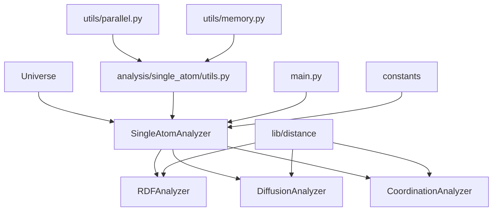

# MDemon单原子分析架构设计计划书

## 1. 项目概述

### 1.1 项目背景
MDemon是一个分子动力学分析框架，基于Universe/Database/Structure的核心架构。本计划旨在构建一个高效的单原子分析子系统，用于分析以单个原子为基本单元的物理化学性质，如径向分布函数(RDF)、原子扩散、配位数等。

### 1.2 设计目标
- **模块化设计**：遵循MDemon现有的模块化架构
- **高性能并行**：利用OpenMP/异步处理实现大规模并行计算
- **易用性**：提供简洁的API接口，支持`from MDemon.analysis.single_atom import ...`
- **可扩展性**：支持新的单原子分析方法的快速集成

### 1.3 架构特点
- **以原子为中心**：每个分析方法都围绕单个原子展开
- **异步并行处理**：利用Python的asyncio和multiprocessing实现高效并行
- **内存优化**：采用流式处理和数据分块技术
- **时间序列支持**：全面支持时间依赖分析

## 2. 系统架构设计

### 2.1 整体架构

```
MDemon/
├── analysis/
│   └── single_atom/
│       ├── __init__.py              # 模块导出接口
│       ├── base.py                  # 基础类和通用函数
│       ├── rdf.py                   # 径向分布函数分析
│       ├── diffusion.py             # 扩散分析
│       ├── coordination.py          # 配位数分析
│       ├── main.py                  # 统一对外接口
│       └── utils.py                 # 单原子分析内部工具函数
├── utils/
│   ├── __init__.py
│   ├── irradiation.py              # 现有辐照计算插件
│   ├── parallel.py                 # 通用并行处理工具
│   └── memory.py                   # 通用内存管理工具
└── tests/
    ├── __init__.py
    ├── test_base.py                 # 现有基础测试
    ├── test_constants.py            # 现有常量测试
    ├── test_flags.py                # 现有标志测试
    ├── test_single_atom_base.py     # 单原子基础测试
    ├── test_single_atom_rdf.py      # 单原子RDF测试
    ├── test_single_atom_diffusion.py # 单原子扩散测试
    ├── test_single_atom_coordination.py # 单原子配位测试
    └── test_single_atom_main.py     # 单原子主接口测试
```

### 2.2 核心组件关系



## 3. 详细设计规范

### 3.1 base.py - 基础架构

#### 3.1.1 核心基类设计
**位置**: `MDemon/analysis/single_atom/base.py`

```python
from abc import ABC, abstractmethod
from .utils import SingleAtomParallelManager, SingleAtomMemoryManager

class SingleAtomAnalyzer(ABC):
    """单原子分析器基类，提供通用的框架和接口"""
    
    def __init__(self, universe, atom_selection=None, **kwargs):
        """
        Parameters:
        -----------
        universe : MDemon.Universe
            分析的宇宙对象
        atom_selection : str or AtomGroup, optional
            原子选择条件，默认为所有原子
        """
        self.universe = universe
        self.atom_selection = atom_selection
        self.parallel_manager = SingleAtomParallelManager(**kwargs.get('parallel_config', {}))
        self.memory_manager = SingleAtomMemoryManager(**kwargs.get('memory_config', {}))
        
    @abstractmethod
    def analyze_single_atom(self, atom_index, **kwargs):
        """分析单个原子的抽象方法"""
        pass
        
    async def analyze_parallel(self, atom_indices=None, **kwargs):
        """并行分析多个原子"""
        if atom_indices is None:
            atom_indices = self._get_selected_atoms()
        
        return await self.parallel_manager.submit_atom_tasks(
            self.analyze_single_atom, atom_indices, **kwargs
        )
        
    def analyze_batch(self, batch_size=None, **kwargs):
        """批量分析，支持大规模原子系统"""
        atom_indices = self._get_selected_atoms()
        
        if batch_size is None:
            available_memory = self.memory_manager.memory_manager.get_memory_usage()
            batch_size = self.memory_manager.optimize_atom_batch_size(
                len(atom_indices), available_memory
            )
        
        results = []
        for i in range(0, len(atom_indices), batch_size):
            batch = atom_indices[i:i+batch_size]
            batch_results = self.analyze_parallel(batch, **kwargs)
            results.extend(batch_results)
            
        return results
        
    def _get_selected_atoms(self):
        """获取选中的原子索引"""
        if self.atom_selection is None:
            return list(range(self.universe.n_atoms))
        else:
            # 实现原子选择逻辑
            return self.universe.select_atoms(self.atom_selection).indices
```

#### 3.1.2 通用并行处理框架
**位置**: `MDemon/utils/parallel.py`

```python
class ParallelManager:
    """通用并行处理管理器"""
    
    def __init__(self, backend='multiprocessing', max_workers=None):
        """
        Parameters:
        -----------
        backend : str
            并行后端：'multiprocessing', 'threading', 'asyncio'
        max_workers : int, optional
            最大工作进程数
        """
        
    async def submit_tasks(self, func, data_list, **kwargs):
        """提交并行任务（通用接口）"""
        
    def optimize_chunk_size(self, total_items, available_memory):
        """优化数据分块大小"""
        
    def get_optimal_worker_count(self, data_size):
        """根据数据规模获取最优工作进程数"""
```

#### 3.1.3 单原子分析特定工具
**位置**: `MDemon/analysis/single_atom/utils.py`

```python
from ...utils.parallel import ParallelManager
from ...utils.memory import MemoryManager

class SingleAtomParallelManager:
    """单原子分析并行处理适配器"""
    
    def __init__(self, **kwargs):
        self.parallel_manager = ParallelManager(**kwargs)
        
    async def submit_atom_tasks(self, func, atom_indices, **kwargs):
        """提交原子分析任务"""
        return await self.parallel_manager.submit_tasks(func, atom_indices, **kwargs)
        
    def estimate_atom_task_complexity(self, n_atoms, analysis_type):
        """估算原子分析任务复杂度"""
        complexity_map = {
            'rdf': n_atoms * 1.0,
            'diffusion': n_atoms * 1.5,
            'coordination': n_atoms * 0.8
        }
        return complexity_map.get(analysis_type, n_atoms)
```

#### 3.1.4 通用内存管理
**位置**: `MDemon/utils/memory.py`

```python
class MemoryManager:
    """通用内存管理器"""
    
    def __init__(self, max_memory_gb=4.0):
        """
        Parameters:
        -----------
        max_memory_gb : float
            最大内存使用量(GB)
        """
        
    def estimate_memory_usage(self, data_size, data_type):
        """估算内存使用量（通用）"""
        
    def create_memory_pool(self, size):
        """创建内存池"""
        
    def stream_process(self, data_generator, process_func):
        """流式处理大数据"""
        
    def get_memory_usage(self):
        """获取当前内存使用情况"""
        
    def optimize_batch_size(self, total_items, available_memory):
        """根据可用内存优化批处理大小"""

class SingleAtomMemoryManager:
    """单原子分析内存管理适配器"""
    
    def __init__(self, **kwargs):
        self.memory_manager = MemoryManager(**kwargs)
        
    def estimate_atom_memory_usage(self, n_atoms, n_frames, analysis_type):
        """估算原子分析内存使用量"""
        base_memory_per_atom = {
            'rdf': 8.0,      # bytes per atom for RDF
            'diffusion': 12.0, # bytes per atom for diffusion  
            'coordination': 6.0 # bytes per atom for coordination
        }
        
        base_memory = base_memory_per_atom.get(analysis_type, 10.0)
        total_memory = n_atoms * n_frames * base_memory
        
        return self.memory_manager.estimate_memory_usage(total_memory, 'analysis')
        
    def optimize_atom_batch_size(self, n_atoms, available_memory):
        """根据可用内存优化原子批处理大小"""
        return self.memory_manager.optimize_batch_size(n_atoms, available_memory)
```

### 3.2 rdf.py - 径向分布函数分析

#### 3.2.1 RDF核心算法
```python
class RDFAnalyzer(SingleAtomAnalyzer):
    """径向分布函数分析器"""
    
    def __init__(self, universe, atom_selection=None, 
                 r_range=(0.0, 10.0), n_bins=100, **kwargs):
        """
        Parameters:
        -----------
        r_range : tuple
            径向距离范围 (r_min, r_max)
        n_bins : int
            距离分箱数量
        """
        super().__init__(universe, atom_selection, **kwargs)
        self.r_range = r_range
        self.n_bins = n_bins
        self.r_bins = np.linspace(r_range[0], r_range[1], n_bins)
        
    def analyze_single_atom(self, atom_index, reference_atoms=None, **kwargs):
        """计算单个原子的RDF"""
        
    async def analyze_parallel_rdf(self, atom_indices=None, **kwargs):
        """并行计算多个原子的RDF"""
        
    def compute_rdf_optimized(self, center_atom, reference_atoms, box):
        """优化的RDF计算，利用MDemon的距离计算库"""
```

#### 3.2.2 时间依赖RDF
```python
class TimeResolvedRDFAnalyzer(RDFAnalyzer):
    """时间分辨RDF分析器"""
    
    def analyze_trajectory(self, atom_indices, frame_range=None, **kwargs):
        """分析轨迹中的时间依赖RDF"""
        
    def compute_time_correlation(self, rdf_series):
        """计算时间相关函数"""
```

### 3.3 diffusion.py - 扩散分析

#### 3.3.1 扩散系数计算
```python
class DiffusionAnalyzer(SingleAtomAnalyzer):
    """扩散分析器"""
    
    def __init__(self, universe, atom_selection=None, 
                 time_window=None, **kwargs):
        """
        Parameters:
        -----------
        time_window : tuple, optional
            时间窗口 (start_time, end_time)
        """
        
    def analyze_single_atom(self, atom_index, **kwargs):
        """计算单个原子的扩散系数"""
        
    def compute_msd(self, atom_index, time_series):
        """计算均方位移(MSD)"""
        
    def compute_diffusion_coefficient(self, msd_data, time_data):
        """从MSD计算扩散系数"""
```

### 3.4 coordination.py - 配位数分析

#### 3.4.1 配位数计算
```python
class CoordinationAnalyzer(SingleAtomAnalyzer):
    """配位数分析器"""
    
    def __init__(self, universe, atom_selection=None, 
                 cutoff_distance=3.0, **kwargs):
        """
        Parameters:
        -----------
        cutoff_distance : float
            配位数计算的截止距离
        """
        
    def analyze_single_atom(self, atom_index, **kwargs):
        """计算单个原子的配位数"""
        
    def compute_coordination_number(self, center_atom, neighbors, cutoff):
        """计算配位数"""
        
    def analyze_coordination_shell(self, atom_index, shell_number=1):
        """分析第n配位壳层"""
```

### 3.5 main.py - 统一接口

#### 3.5.1 主接口设计
```python
class SingleAtomAnalysis:
    """单原子分析主接口"""
    
    def __init__(self, universe, **kwargs):
        """
        Parameters:
        -----------
        universe : MDemon.Universe
            分析的宇宙对象
        """
        self.universe = universe
        self._analyzers = {}
        self._initialize_analyzers()
        
    def rdf(self, atom_selection=None, **kwargs):
        """RDF分析接口"""
        return self._analyzers['rdf'].analyze_parallel(
            atom_selection=atom_selection, **kwargs
        )
        
    def diffusion(self, atom_selection=None, **kwargs):
        """扩散分析接口"""
        return self._analyzers['diffusion'].analyze_parallel(
            atom_selection=atom_selection, **kwargs
        )
        
    def coordination(self, atom_selection=None, **kwargs):
        """配位数分析接口"""
        return self._analyzers['coordination'].analyze_parallel(
            atom_selection=atom_selection, **kwargs
        )
        
    async def analyze_all(self, atom_selection=None, **kwargs):
        """同时进行所有分析"""
        results = await asyncio.gather(
            self.rdf(atom_selection, **kwargs),
            self.diffusion(atom_selection, **kwargs),
            self.coordination(atom_selection, **kwargs)
        )
        return {
            'rdf': results[0],
            'diffusion': results[1],
            'coordination': results[2]
        }
```

## 4. 性能优化策略

### 4.1 并行化策略

#### 4.1.1 三级并行架构
1. **原子级并行**：不同原子的分析并行执行
2. **帧级并行**：时间序列数据的并行处理
3. **计算级并行**：单个计算任务的内部并行（利用OpenMP）

#### 4.1.2 自适应负载均衡
```python
class LoadBalancer:
    """负载均衡器"""
    
    def __init__(self, n_workers):
        self.n_workers = n_workers
        self.task_queue = asyncio.Queue()
        self.result_queue = asyncio.Queue()
        
    async def distribute_tasks(self, tasks):
        """智能分发任务"""
        
    def estimate_task_complexity(self, task):
        """估算任务复杂度"""
```

### 4.2 内存优化

#### 4.2.1 流式处理
```python
class StreamProcessor:
    """流式数据处理器"""
    
    def __init__(self, chunk_size=1000):
        self.chunk_size = chunk_size
        
    async def process_stream(self, data_generator, process_func):
        """流式处理数据"""
        
    def optimize_chunk_size(self, total_size, available_memory):
        """优化分块大小"""
```

#### 4.2.2 数据缓存策略
```python
class DataCache:
    """数据缓存管理"""
    
    def __init__(self, max_size_gb=2.0):
        self.max_size = max_size_gb * 1024**3
        self.cache = {}
        
    def get_cached_distances(self, atom_pair):
        """获取缓存的距离数据"""
        
    def cache_frame_data(self, frame_index, data):
        """缓存帧数据"""
```

### 4.3 算法优化

#### 4.3.1 利用MDemon现有优化
- 使用`MDemon.lib.distance`的OpenMP并行距离计算
- 利用`MDemon.core.structure`的高效数据结构
- 复用`MDemon.constants`的物理常量
- 使用`MDemon.utils`的通用工具函数

#### 4.3.2 单原子分析优化算法
**位置**: `MDemon/analysis/single_atom/utils.py`

```python
class OptimizedCalculations:
    """单原子分析优化计算模块"""
    
    @staticmethod
    def fast_rdf_calculation(coords, box, r_range, n_bins):
        """优化的RDF计算"""
        # 利用MDemon的C扩展进行快速计算
        from MDemon.lib.distance import distance_array
        distances = distance_array(coords, coords, box=box, backend='openmp')
        
        # 计算RDF
        import numpy as np
        r_bins = np.linspace(r_range[0], r_range[1], n_bins)
        hist, _ = np.histogram(distances.flatten(), bins=r_bins)
        return r_bins[:-1], hist
        
    @staticmethod
    def vectorized_msd(trajectories):
        """向量化的MSD计算"""
        # 使用NumPy向量化操作
        import numpy as np
        displacement = trajectories - trajectories[0]
        msd = np.mean(np.sum(displacement**2, axis=2), axis=1)
        return msd
        
    @staticmethod
    def fast_coordination_number(center_coords, neighbor_coords, cutoff, box=None):
        """快速配位数计算"""
        from MDemon.lib.distance import distance_array
        distances = distance_array(center_coords, neighbor_coords, box=box, backend='openmp')
        return np.sum(distances <= cutoff, axis=1)
```

#### 4.3.3 与现有MDemon组件的协同
- **并行处理**：与`MDemon.lib.distance`的OpenMP后端协同
- **内存管理**：与MDemon核心的Database内存管理协同
- **数据结构**：充分利用MDemon的Structure和StructureAttr系统
- **常量系统**：复用`MDemon.constants`的物理化学常量

#### 4.3.4 Utils目录配置
**位置**: `MDemon/utils/__init__.py`

```python
"""
Utilities for Molecular Dynamics Analysis

This module contains utility classes and functions for various MD analysis tasks,
including radiation physics calculations and general parallel/memory management.

Available utilities:
    - WaligorskiZhangCalculator: Radial dose distribution calculator for ion irradiation
    - ParallelManager: General parallel processing manager
    - MemoryManager: General memory management utilities
"""

from .irradiation import WaligorskiZhangCalculator
from .parallel import ParallelManager
from .memory import MemoryManager

__all__ = [
    'WaligorskiZhangCalculator',
    'ParallelManager', 
    'MemoryManager',
]
```

## 5. 数据结构设计

### 5.1 结果数据结构

#### 5.1.1 分析结果基类
```python
class AnalysisResult:
    """分析结果基类"""
    
    def __init__(self, analysis_type, atom_indices, metadata=None):
        self.analysis_type = analysis_type
        self.atom_indices = atom_indices
        self.metadata = metadata or {}
        self.timestamp = datetime.now()
        
    def to_dict(self):
        """转换为字典格式"""
        
    def save(self, filename, format='hdf5'):
        """保存结果到文件"""
        
    def load(self, filename, format='hdf5'):
        """从文件加载结果"""
```

#### 5.1.2 RDF结果结构
```python
class RDFResult(AnalysisResult):
    """RDF分析结果"""
    
    def __init__(self, atom_indices, r_bins, rdf_values, **kwargs):
        super().__init__('rdf', atom_indices, **kwargs)
        self.r_bins = r_bins
        self.rdf_values = rdf_values
        
    def plot(self, atom_index=None, **kwargs):
        """绘制RDF图"""
        
    def get_first_peak(self, atom_index=None):
        """获取第一个峰的位置"""
```

### 5.2 配置管理

#### 5.2.1 配置系统
```python
class AnalysisConfig:
    """分析配置管理"""
    
    def __init__(self, config_file=None):
        self.config = self._load_default_config()
        if config_file:
            self._load_config_file(config_file)
            
    def get_parallel_config(self):
        """获取并行配置"""
        
    def get_memory_config(self):
        """获取内存配置"""
        
    def optimize_for_system(self, n_atoms, n_frames, system_memory):
        """根据系统参数优化配置"""
```

## 6. 接口规范

### 6.1 导入接口

#### 6.1.1 主要导入方式
```python
# 方式1：导入主接口
from MDemon.analysis.single_atom import SingleAtomAnalysis

# 方式2：导入特定分析器
from MDemon.analysis.single_atom import RDFAnalyzer, DiffusionAnalyzer

# 方式3：导入所有功能
from MDemon.analysis.single_atom import *

# 方式4：导入通用工具类（高级用法）
from MDemon.utils.parallel import ParallelManager
from MDemon.utils.memory import MemoryManager
```

#### 6.1.2 使用示例
```python
# 创建分析对象
analysis = SingleAtomAnalysis(universe)

# 进行RDF分析
rdf_results = await analysis.rdf(atom_selection="name CA", 
                                 r_range=(0, 10), 
                                 n_bins=100)

# 进行扩散分析
diffusion_results = await analysis.diffusion(atom_selection="name CA")

# 同时进行多种分析
all_results = await analysis.analyze_all(atom_selection="name CA")

# 高级用法：自定义并行和内存配置
custom_config = {
    'parallel_config': {'backend': 'multiprocessing', 'max_workers': 8},
    'memory_config': {'max_memory_gb': 8.0}
}
analysis = SingleAtomAnalysis(universe, **custom_config)
```

#### 6.1.3 与MDemon生态系统的集成
```python
# 与MDemon其他模块的无缝集成
from MDemon.analysis.single_atom import SingleAtomAnalysis
from MDemon.core import Universe
from MDemon.reader import LAMMPS

# 读取数据并创建Universe
u = Universe("trajectory.dump", format="LAMMPS")

# 创建单原子分析器，使用自定义配置
analysis = SingleAtomAnalysis(u, parallel_config={'max_workers': 8})

# 执行分析
results = await analysis.analyze_all(atom_selection="type 1")
```

### 6.2 API设计原则

#### 6.2.1 一致性原则
- 所有分析器都继承自`SingleAtomAnalyzer`
- 统一的参数命名和返回格式
- 一致的异常处理机制

#### 6.2.2 可扩展性原则
- 插件化的分析器架构
- 灵活的配置系统
- 标准化的结果格式

## 7. 测试策略

### 7.1 单元测试

#### 7.1.1 测试文件结构
**位置**: `MDemon/tests/`

- `test_single_atom_base.py`: 基础分析器测试
- `test_single_atom_rdf.py`: RDF分析器测试
- `test_single_atom_diffusion.py`: 扩散分析器测试
- `test_single_atom_coordination.py`: 配位数分析器测试
- `test_single_atom_main.py`: 主接口测试

#### 7.1.2 工具测试
**位置**: `MDemon/tests/`

- `test_single_atom_parallel.py`: 并行处理工具测试
- `test_single_atom_memory.py`: 内存管理工具测试

#### 7.1.3 测试覆盖范围
- 基础功能测试
- 并行处理测试
- 内存管理测试
- 性能基准测试
- 与现有MDemon组件的兼容性测试

#### 7.1.4 测试数据生成器
**位置**: `MDemon/tests/test_single_atom_data.py`

```python
class TestDataGenerator:
    """单原子分析测试数据生成器"""
    
    @staticmethod
    def generate_simple_system(n_atoms=100, n_frames=50):
        """生成简单测试系统"""
        
    @staticmethod
    def generate_complex_system(n_atoms=10000, n_frames=1000):
        """生成复杂测试系统"""
        
    @staticmethod
    def generate_benchmark_system(n_atoms=50000, n_frames=1000):
        """生成性能基准测试系统"""
```

### 7.2 集成测试

#### 7.2.1 系统集成测试
- 与MDemon核心系统的集成
- 与现有分析模块的兼容性
- 与MDemon.utils现有工具的兼容性
- 不同操作系统的兼容性

#### 7.2.2 性能测试
- 大规模系统性能测试
- 并行效率测试
- 内存使用效率测试
- 与现有MDemon性能基准对比

## 8. 实现计划

### 8.1 开发阶段

#### 第一阶段（基础架构）
1. 实现`MDemon/utils/parallel.py`通用并行处理框架
2. 实现`MDemon/utils/memory.py`通用内存管理系统
3. 更新`MDemon/utils/__init__.py`以导出新的工具模块
4. 实现`MDemon/analysis/single_atom/utils.py`单原子分析工具适配器
5. 实现`MDemon/analysis/single_atom/base.py`基础类
6. 完成基础单元测试（`MDemon/tests/test_single_atom_base.py`等）

#### 第二阶段（核心功能）
1. 实现`MDemon/analysis/single_atom/rdf.py`RDF分析器
2. 实现`MDemon/analysis/single_atom/diffusion.py`扩散分析器
3. 实现`MDemon/analysis/single_atom/coordination.py`配位数分析器
4. 完成功能测试（`MDemon/tests/test_single_atom_*.py`）

#### 第三阶段（集成优化）
1. 实现`MDemon/analysis/single_atom/main.py`统一接口
2. 完善`MDemon/analysis/single_atom/__init__.py`导出接口
3. 性能优化和并行化
4. 完成集成测试和性能基准测试

#### 第四阶段（扩展完善）
1. 添加更多分析方法
2. 优化用户体验
3. 完善错误处理和异常管理
4. 与现有MDemon组件的深度集成
5. 文档编写和版本发布

### 8.2 时间计划

| 阶段 | 时间 | 主要任务 |
|------|------|----------|
| 第一阶段 | 2.5周 | 通用工具和基础架构开发 |
| 第二阶段 | 3周 | 核心功能实现 |
| 第三阶段 | 2周 | 集成和优化 |
| 第四阶段 | 1.5周 | 扩展和完善 |

## 9. 风险评估与对策

### 9.1 技术风险

#### 9.1.1 并行处理复杂性
- **风险**：异步并行处理可能导致数据竞争和死锁
- **对策**：使用成熟的并行库，充分测试并发场景

#### 9.1.2 内存管理挑战
- **风险**：大规模系统可能导致内存溢出
- **对策**：实现流式处理和自适应内存管理

### 9.2 性能风险

#### 9.2.1 计算效率
- **风险**：Python性能限制可能影响大规模计算
- **对策**：充分利用MDemon的C扩展，关键部分使用Cython

#### 9.2.2 可扩展性
- **风险**：系统规模增大时性能下降
- **对策**：实现分层并行架构，优化算法复杂度

## 10. 总结

本设计计划提供了一个完整的单原子分析架构，完全遵循MDemon的项目组织规范，具有以下特点：

1. **规范化目录结构**：
   - 分析核心代码位于`MDemon/analysis/single_atom/`
   - 通用工具函数统一放在`MDemon/utils/`
   - 测试代码统一放在`MDemon/tests/`

2. **高度模块化**：遵循MDemon的设计理念，易于维护和扩展

3. **通用工具设计**：
   - `MDemon/utils/`放置通用的并行和内存管理工具
   - 单原子分析通过适配器模式使用通用工具
   - 保持工具的通用性和可复用性

4. **高性能并行**：三级并行架构，支持大规模系统分析

5. **内存优化**：流式处理和智能缓存，适应不同规模的系统

6. **用户友好**：简洁的API设计，统一的接口规范

7. **可扩展性**：插件化架构，支持新分析方法的快速集成

8. **清晰的关注点分离**：
   - 通用工具专注于底层功能
   - 分析模块专注于科学计算
   - 避免模块间的不必要耦合

9. **性能协同**：充分利用MDemon的C扩展和OpenMP优化

该架构将为MDemon提供强大的单原子分析能力，满足分子动力学研究的多样化需求，同时保持与现有代码库的高度兼容性。

---

*本计划书基于MDemon v0.1.0架构设计，后续版本可能需要相应调整。*

**联系方式**：MDemon开发团队  
**最后更新**：2024年12月 